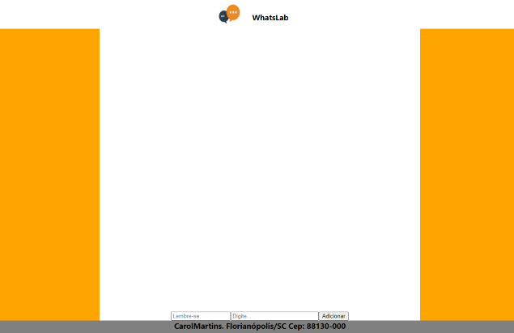
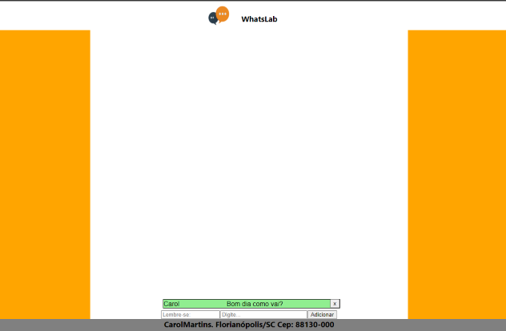

# WhatsLab 💬
---

**Projeto realizado em Front End**

Clone de aplicativo de mensagens.

## Abrir e rodar 🛠

Após baixar o projeto:

- verifique estar dentro da pasta principal,
- git install,
- npm run start.

---

## Funcionalidade

### *Página principal sem mensagens enviadas.*

### *Página com mensagens enviadas podendo ser excluidas*

